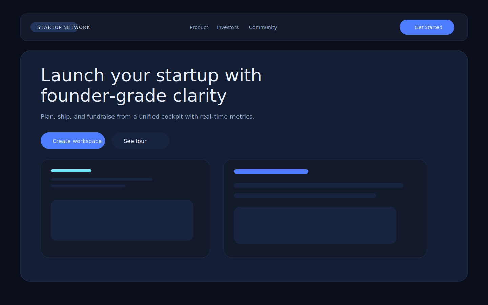
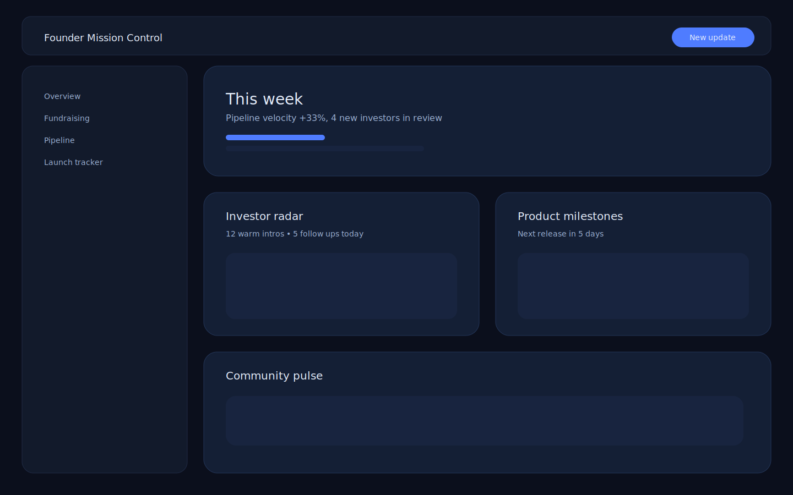
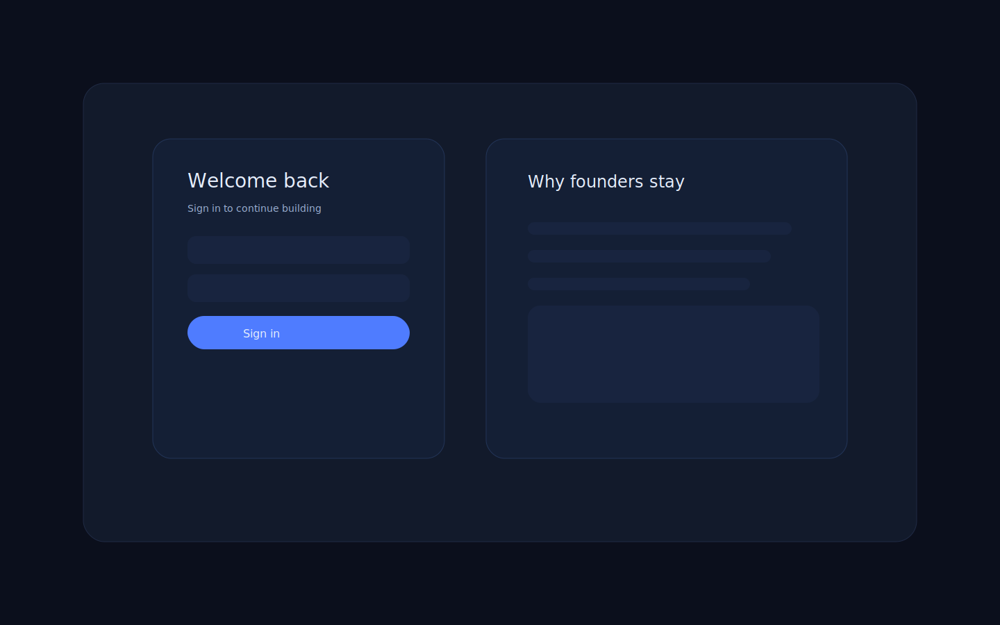
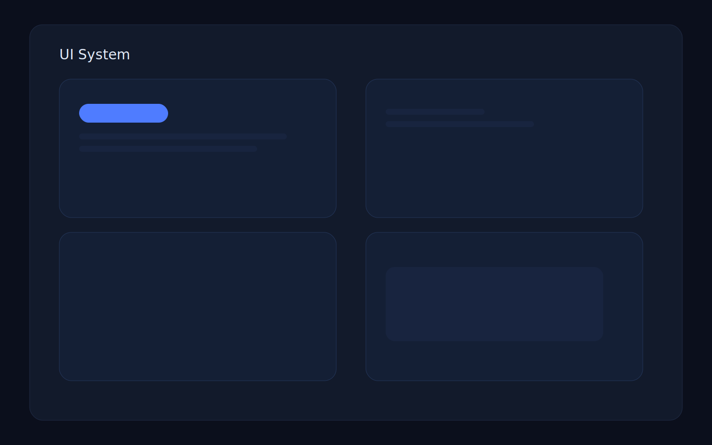

# Startup Network

A premium founder operating system for launching, fundraising, and running a modern startup. This repo ships a production-style MERN stack with a bespoke UI system, deterministic tests, and SVG-based preview screenshots.

## Highlights
- Mission-control UI with light/dark themes and reusable components.
- Express API with request IDs, rate limiting, and normalized error responses.
- End-to-end developer workflow: install once, dev once, verify once.
- Text-based SVG previews committed under `docs/screenshots/`.

## Quickstart
```bash
npm install
npm run dev
```

## Scripts

| Script | Description |
| --- | --- |
| `npm run dev` | Run client + server concurrently |
| `npm run build` | Build the client for production |
| `npm run test` | Run server + client tests |
| `npm run verify` | Lint, typecheck, tests, and smoke checks |
| `npm run smoke` | Smoke test the API with in-memory MongoDB |
| `npm run previews:svg` | Regenerate SVG previews |
| `npm run preview` | Build + run production-like server |

## Architecture
- System overview: [`ARCHITECTURE.md`](ARCHITECTURE.md)
- API reference: [`API.md`](API.md)

```
Client (React + Redux)
  |  REST
  v
Server (Express + MongoDB)
  |  Models
  v
Persistence (Mongoose)
```

## Preview screenshots (SVG)





## Verification
See [`docs/VERIFICATION.md`](docs/VERIFICATION.md) for full command output and LOC proof.
